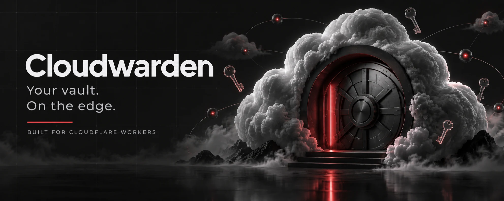
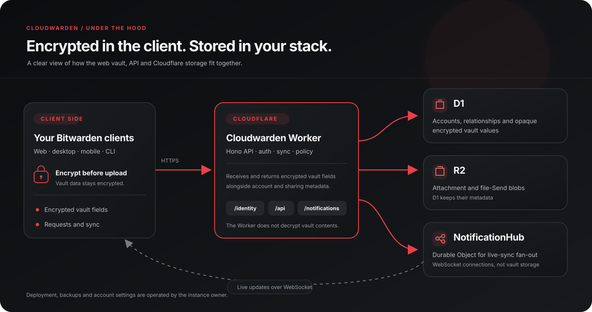
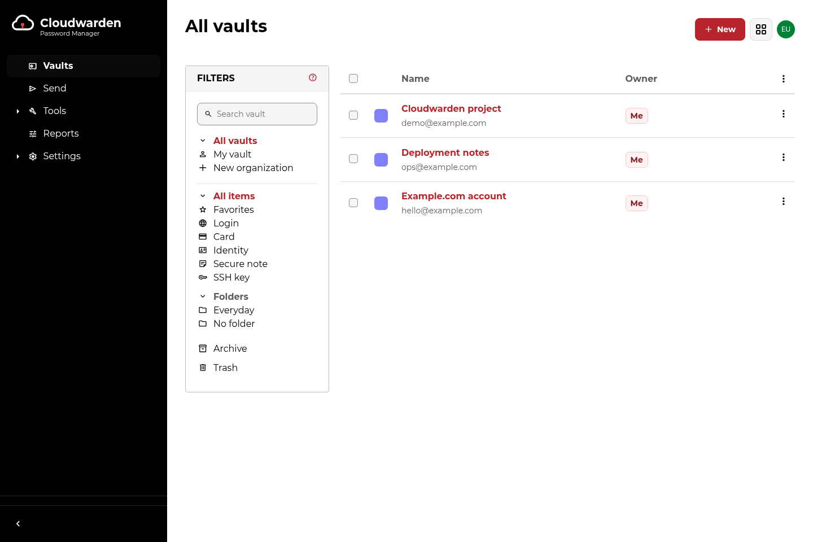
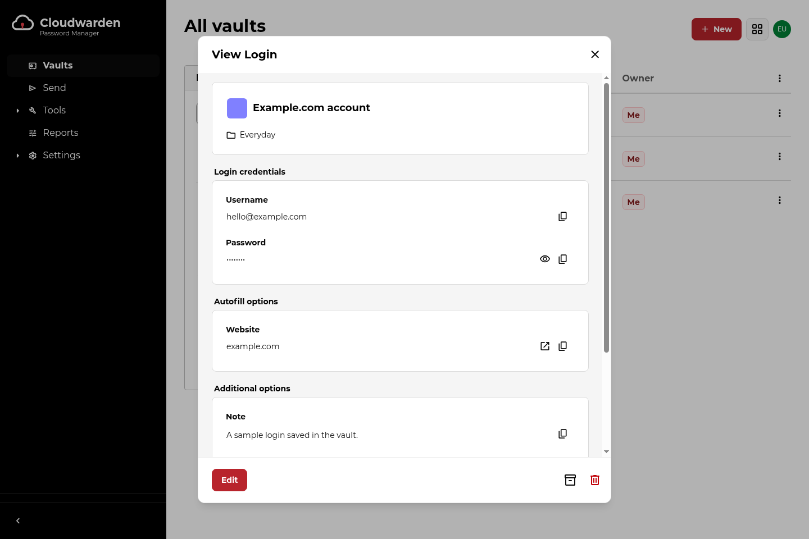
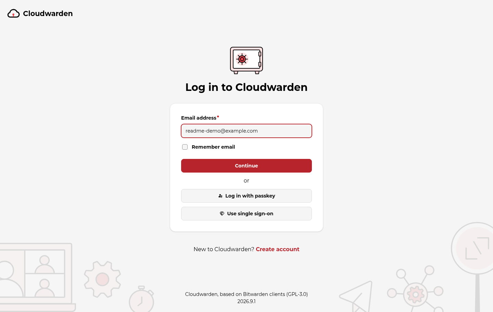

# Cloudwarden

<p align="center"></p>

A Bitwarden-compatible password manager server for Cloudflare Workers, written in TypeScript.

Cloudwarden implements the Bitwarden server API, built from an explicit API contract (OpenAPI), so the official Bitwarden clients can use a self-hosted server. It runs serverless on Cloudflare:

- **Workers** for the API (Hono)
- **D1** (SQLite) for relational data
- **R2** for attachments and file Sends
- **Durable Objects** for live sync notifications
- An **optional instance admin** (native pages in the web client), off by default

> **Status: pre-1.0, not independently audited.** The server implements the vault, organisation, sharing, Send, two-step login, Secrets Manager and admin APIs, and a Cloudwarden build of the web vault ships with it. It is exercised against the official Bitwarden CLI in CI, but it has had no third-party security review, so treat it as experimental and keep backups. See [docs/compatibility.md](docs/compatibility.md) for what is verified and [TASKS.md](TASKS.md) for the roadmap.

## Architecture

Vault fields are encrypted in the client before they reach Cloudwarden. The Worker handles authentication, API requests and synchronisation; D1 stores relational records and encrypted values, R2 stores attachments and file Sends, and a Durable Object fans out live-sync notifications.

<p align="center"></p>

## Web vault

The bundled web client connects to a self-hosted Cloudwarden server. Screenshots use fictional `example.com` data; see [capture provenance](docs/images/README.md).

<p align="center"></p>

<details>
<summary>More web-vault screenshots</summary>

**Vault item details**

<p align="center"></p>

**Sign-in**

<p align="center"></p>

</details>

## Why D1

The Bitwarden data model is relational (users, organisations, collections, many-to-many sharing) and fits SQLite well. D1 gives managed SQLite with migrations and point-in-time restore. The trade-offs (no interactive transactions, 10 GB per database, PBKDF2 iteration cap in Workers) are recorded in [ADR 0001](docs/adr/0001-storage-d1.md).

## Quick start

Requirements: Node 22, pnpm 9, and the Cloudflare `cf` CLI.

```sh
pnpm install
pnpm dev
```

`JWT_SECRET` is a Worker secret; to supply it locally run `LOCAL_DEV_SECRETS=true JWT_SECRET=<32+ characters> pnpm dev`.

Then point a Bitwarden client's self-hosted server URL at the local address `pnpm dev` prints.

## Configuration

| Name | Kind | Default | Purpose |
|---|---|---|---|
| `DOMAIN` | var | `https://vault.example.com` | Public base URL |
| `SIGNUPS_ALLOWED` | var | `false` | Allow open registration |
| `SIGNUPS_DOMAINS_WHITELIST` | var | empty | Comma-separated domains or addresses allowed to register publicly while `SIGNUPS_ALLOWED` is false. Public sign-up only: organisation invite links admit their own allowed domains without it |
| `ADMIN_ENABLED` | var | `false` | Enable the admin API behind the web client's Instance admin |
| `JWT_SECRET` | secret | none | Token signing key |
| `ADMIN_EMAILS` | secret | none | Comma-separated instance owner addresses (further admins are granted in Instance admin). Owners and the admins granted in Instance admin can create organisations |

## Documentation

- [Architecture](docs/architecture.md)
- [Local development and the dev container](docs/local-dev.md)
- [Contributing](CONTRIBUTING.md)
- [Security policy](SECURITY.md)

## Disclaimer

Cloudwarden is not affiliated with, endorsed by, or associated with Bitwarden, Inc. or the Vaultwarden project. Bitwarden is a trademark of Bitwarden, Inc.

## Licence

The server code in this repository is licensed under the [GNU AGPL-3.0](LICENSE). The vendored web client in [`web/`](web/) is a modified copy of the Bitwarden web vault and stays under the GNU GPL-3.0 (see [`web/NOTICE.md`](web/NOTICE.md), `web/LICENSE_GPL.txt`). The two are combined into one deployed work under section 13 of the GPL-3.0 and section 13 of the AGPL-3.0, so the whole deployed work is offered under the terms of the AGPL-3.0 for network users, while `web/` remains GPL-3.0 code. No code under the Bitwarden License or the Bitwarden SDK licence is included.
